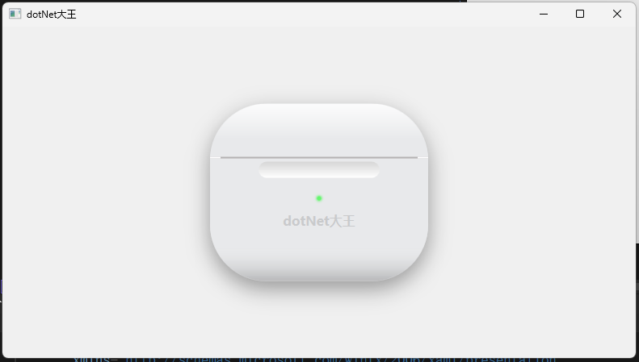

# BluetoothHeadphonesUI 

这是一个基于 WPF XAML 实现的拟物化蓝牙耳机 UI 设计。

## 💡 项目说明

本项目视觉原型参考自 B 站 **@原子软糖** 的 HTML/CSS 作品。我使用 **WPF XAML** 进行了重构实现，旨在练习 XAML 在拟物化风格中的表现力。

## 🛠️ 实现细节

- **纯代码绘制**：不使用外部图片资源，完全通过 XAML 标签完成。
- **质感模拟**：
    - 使用多层 `Border` 嵌套实现圆润的外壳边框。
    - 使用 `BlurEffect` 还原 LED 指示灯的透光效果。
    - 细微的线条处理模拟充电盒的物理缝隙。

## 🏷️ 技术栈

- 框架：.NET / WPF
- 核心：XAML 矢量绘图、阴影特效、渐变画刷
